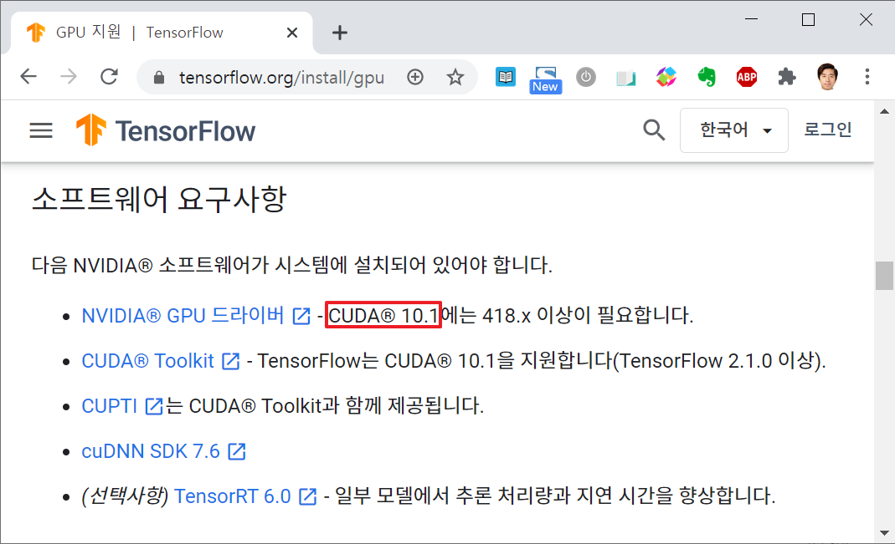
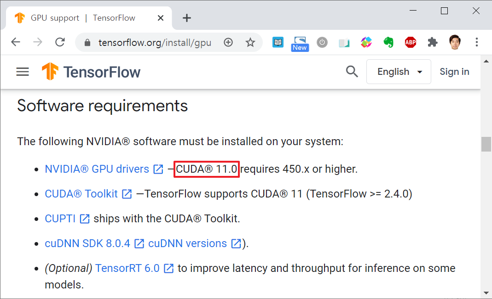
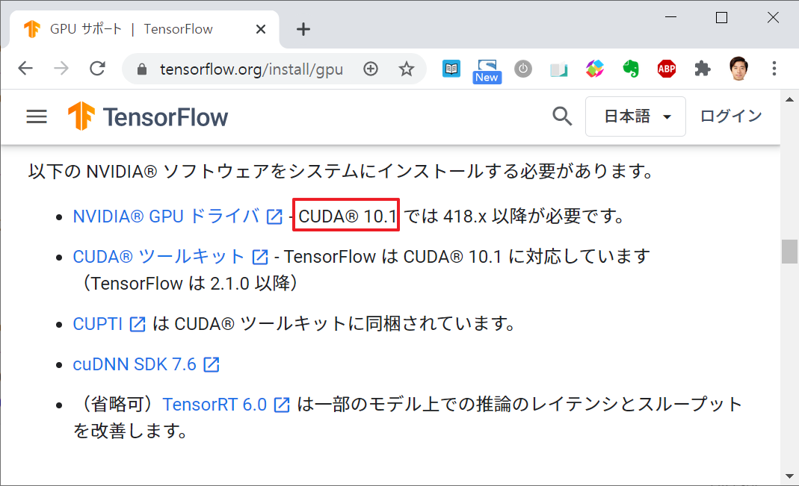
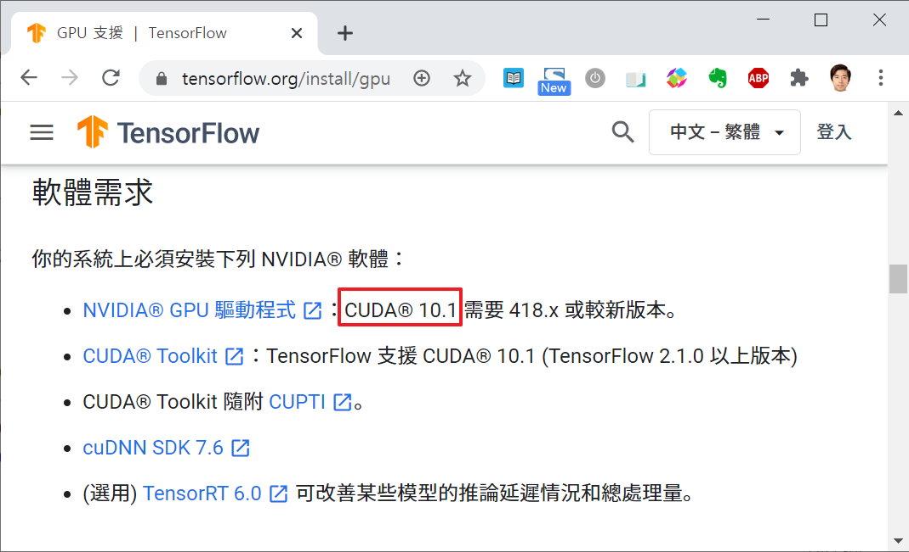

* Draft: 2021-01-21 (Thu)

# 

## 문제

텐서플로 홈페이지의 GPU지원에 있는 명령어를 실행했습니다. 

[Ubuntu 18.04(CUDA 10.1)](https://www.tensorflow.org/install/gpu#ubuntu_1804_cuda_101)

```bash
# Add NVIDIA package repositories
wget https://developer.download.nvidia.com/compute/cuda/repos/ubuntu1804/x86_64/cuda-repo-ubuntu1804_10.1.243-1_amd64.deb
sudo apt-key adv --fetch-keys https://developer.download.nvidia.com/compute/cuda/repos/ubuntu1804/x86_64/7fa2af80.pub
sudo dpkg -i cuda-repo-ubuntu1804_10.1.243-1_amd64.deb
sudo apt-get update
wget http://developer.download.nvidia.com/compute/machine-learning/repos/ubuntu1804/x86_64/nvidia-machine-learning-repo-ubuntu1804_1.0.0-1_amd64.deb
sudo apt install ./nvidia-machine-learning-repo-ubuntu1804_1.0.0-1_amd64.deb
sudo apt-get update

# Install NVIDIA driver
sudo apt-get install --no-install-recommends nvidia-driver-450
# Reboot. Check that GPUs are visible using the command: nvidia-smi

# Install development and runtime libraries (~4GB)
sudo apt-get install --no-install-recommends \
    cuda-10-1 \
    libcudnn7=7.6.5.32-1+cuda10.1  \
    libcudnn7-dev=7.6.5.32-1+cuda10.1


# Install TensorRT. Requires that libcudnn7 is installed above.
sudo apt-get install -y --no-install-recommends libnvinfer6=6.0.1-1+cuda10.1 \
    libnvinfer-dev=6.0.1-1+cuda10.1 \
    libnvinfer-plugin6=6.0.1-1+cuda10.1
```

CUDA10.1을 설치하는 명령어인데 설치 완료, 재부팅 후 CUDA 버전을 확인하니까 `11.2`버전이 설치되었습니다.

```
$ nvidia-smi
Wed Jan 20 17:29:55 2021       
+-----------------------------------------------------------------------------+
| NVIDIA-SMI 460.32.03    Driver Version: 460.32.03    CUDA Version: 11.2     |
|-------------------------------+----------------------+----------------------+
| GPU  Name        Persistence-M| Bus-Id        Disp.A | Volatile Uncorr. ECC |
| Fan  Temp  Perf  Pwr:Usage/Cap|         Memory-Usage | GPU-Util  Compute M. |
|                               |                      |               MIG M. |
|===============================+======================+======================|
|   0  GeForce GTX 1080    On   | 00000000:01:00.0  On |                  N/A |
| 28%   32C    P8     8W / 180W |    136MiB /  8118MiB |      0%      Default |
|                               |                      |                  N/A |
+-------------------------------+----------------------+----------------------+
|   1  GeForce GTX 1080    On   | 00000000:02:00.0 Off |                  N/A |
| 27%   28C    P8     5W / 180W |      2MiB /  8119MiB |      0%      Default |
|                               |                      |                  N/A |
+-------------------------------+----------------------+----------------------+
                                                                               
+-----------------------------------------------------------------------------+
| Processes:                                                                  |
|  GPU   GI   CI        PID   Type   Process name                  GPU Memory |
|        ID   ID                                                   Usage      |
|=============================================================================|
|    0   N/A  N/A      1120      G   /usr/lib/xorg/Xorg                 96MiB |
|    0   N/A  N/A      1250      G   /usr/bin/gnome-shell               36MiB |
+-----------------------------------------------------------------------------+
$
```

OS부터 재설치해봤지만 똑같습니다. 구글 검색에서 제안하는 여러가지 해결책을 적용해봤지만 문제해결이 되지 않습니다. 참고로 GPU설치에 대한 충분한 경험을 가지고 있다고 생각하지만, 이번 에러는 도저히 이해할 수 없습니다. 도대체 왜 이런 현상이 일어나는 것이고, 어떻게 하면 해결할 수 있을까요? 

## 원인

한국어 홈페이지에는 CUDA10.1이라고 되어 있지만 영어 홈페이지에는 CUDA11.0이라고 되어 있습니다. 이 문제의 원인은 기술적인 것이 아니라 단순히 홈페이지의 업데이트가 늦어서 생기는 문제로 보입니다.





영어 홈페이지에는 동일한 명령어 부분이 CUDA11.0으로 업데이트 되어 있고, 명령어의 값이 11.0버전에 맞게 수정되어 있습니다.

[Ubuntu 18.04 (CUDA 11.0)](https://www.tensorflow.org/install/gpu#ubuntu_1804_cuda_110)

```bash
# Add NVIDIA package repositories
wget https://developer.download.nvidia.com/compute/cuda/repos/ubuntu1804/x86_64/cuda-ubuntu1804.pin
sudo mv cuda-ubuntu1804.pin /etc/apt/preferences.d/cuda-repository-pin-600
sudo apt-key adv --fetch-keys https://developer.download.nvidia.com/compute/cuda/repos/ubuntu1804/x86_64/7fa2af80.pub
sudo add-apt-repository "deb https://developer.download.nvidia.com/compute/cuda/repos/ubuntu1804/x86_64/ /"
sudo apt-get update

wget http://developer.download.nvidia.com/compute/machine-learning/repos/ubuntu1804/x86_64/nvidia-machine-learning-repo-ubuntu1804_1.0.0-1_amd64.deb

sudo apt install ./nvidia-machine-learning-repo-ubuntu1804_1.0.0-1_amd64.deb
sudo apt-get update

# Install NVIDIA driver
sudo apt-get install --no-install-recommends nvidia-driver-450
# Reboot. Check that GPUs are visible using the command: nvidia-smi

wget https://developer.download.nvidia.com/compute/machine-learning/repos/ubuntu1804/x86_64/libnvinfer7_7.1.3-1+cuda11.0_amd64.deb
sudo apt install ./libnvinfer7_7.1.3-1+cuda11.0_amd64.deb
sudo apt-get update

# Install development and runtime libraries (~4GB)
sudo apt-get install --no-install-recommends \
    cuda-11-0 \
    libcudnn8=8.0.4.30-1+cuda11.0  \
    libcudnn8-dev=8.0.4.30-1+cuda11.0


# Install TensorRT. Requires that libcudnn8 is installed above.
sudo apt-get install -y --no-install-recommends libnvinfer7=7.1.3-1+cuda11.0 \
    libnvinfer-dev=7.1.3-1+cuda11.0 \
    libnvinfer-plugin7=7.1.3-1+cuda11.0
```

위의 명령어를 새로 설치한 우분투 18.04에서 실행했더니, 원하는대로 11.0이 설치되었습니다.

```bash
$ nvidia-smi
Thu Jan 21 18:33:14 2021
+-----------------------------------------------------------------------------+
| NVIDIA-SMI 450.102.04   Driver Version: 450.102.04   CUDA Version: 11.0     |
|-------------------------------+----------------------+----------------------+
| GPU  Name        Persistence-M| Bus-Id        Disp.A | Volatile Uncorr. ECC |
| Fan  Temp  Perf  Pwr:Usage/Cap|         Memory-Usage | GPU-Util  Compute M. |
|                               |                      |               MIG M. |
|===============================+======================+======================|
|   0  GeForce GTX 1080    On   | 00000000:01:00.0 Off |                  N/A |
|  0%   32C    P8     6W / 200W |    309MiB /  8118MiB |      0%      Default |
|                               |                      |                  N/A |
+-------------------------------+----------------------+----------------------+

+-----------------------------------------------------------------------------+
| Processes:                                                                  |
|  GPU   GI   CI        PID   Type   Process name                  GPU Memory |
|        ID   ID                                                   Usage      |
|=============================================================================|
|    0   N/A  N/A      1105      G   /usr/lib/xorg/Xorg                168MiB |
|    0   N/A  N/A      1236      G   /usr/bin/gnome-shell              137MiB |
+-----------------------------------------------------------------------------+
$
```

## 확인

다른 외국어 페이지 (일본어, 중국어)를 확인해봤더니 한국어처럼 업데이트가 늦네요. 비단 한국어뿐만이 아니라, 영어 홈페이지의 내용을 먼저 업데이트하기 때문에 발생하는 문제인 것 같습니다.





