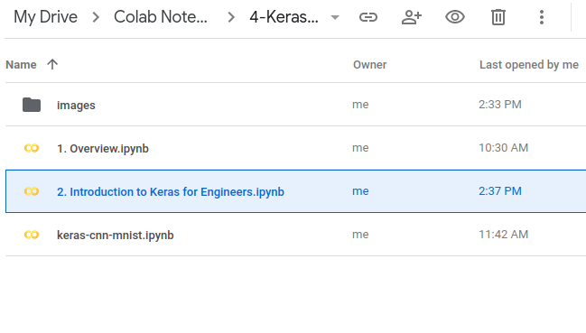
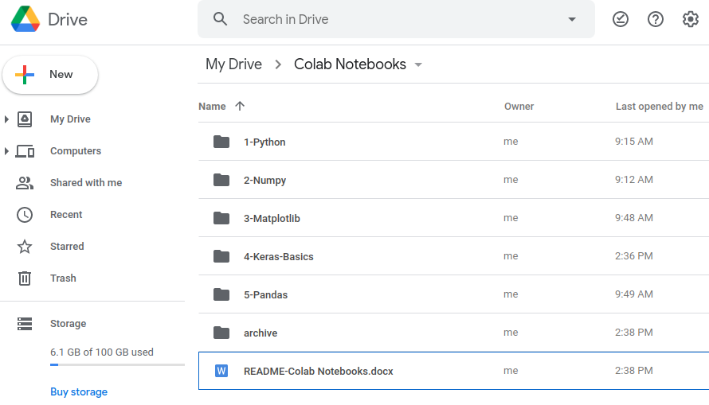

* Draft: 2020-11-23 (Mon)

# 구글 코랩에서 파일 찾기

## 문제

케라스에서 체크포인트 파일, 로그 파일 등을 저장하는 명령어를 실행하고 구글 드라이브의 `Colab Notebooks` 폴더를 찾아봐도 해당 파일을 찾을 수가 없다.

예를 들어, 콜백함수를 써서 모델의 체크포인트를 저장하는 명령어를 실행했다고 하자.

```python
callbacks = [
    keras.callbacks.ModelCheckpoint(
        filepath='model_{epoch}',
        save_freq='epoch')
]
model.fit(dataset, epochs=2, callbacks=callbacks)
```

`filepath`에 명시한 것처럼 현재 디렉토리 밑에 `model_1`, `model_2`와 같이 디렉토리가 만들어져야 하는데, 위 명령어가 포함된 `.ipynb`파일이 있는 현재 디렉토리 밑에는 없다.



상위 디렉토리를 확인해도 없음을 알 수 있다.



## 힌트

주피터 노트북에서 시스템 명령어를 수행하게 해주는 매직 명령어를 실행해본다. `ls` 명령어를 실행하면 

```bash
%ls
model_1/  model_2/  path/  sample_data/
```

`model_1`, `model_2` 디렉토리가 생성되었음을 확인할 수 있다.

이곳의 위치를 확인해보면

```bash
%pwd
`/content`
```

## 해결

리눅스 명령어로 확인한다.

```bash
%ls model_1
assets/  saved_model.pb  variables/
```

```bash
%ls model_2
assets/  saved_model.pb  variables/
```

